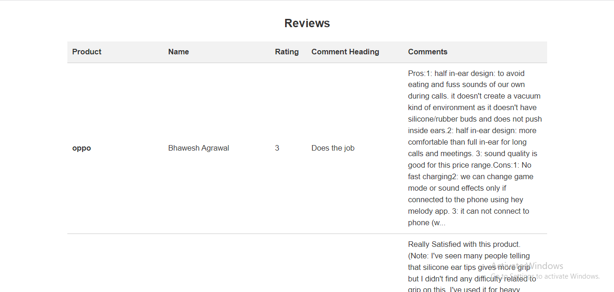

# Flipkart Review Scraper
This is a web application built with Flask that allows users to search for products on Flipkart and extract their reviews as CSV files.

## Features
Search for a product on Flipkart using a keyword
Extract reviews of the product and save them as a CSV file
Display the reviews on a web page

## User Interface

### Home Page
The home page displays a search box where users can enter the product they want to search for on Flipkart. 

### Results Page
After entering the product name and clicking on the 'Search' button, the results page displays a table of product reviews extracted from Flipkart website.

## Usage
Clone the repository.
Install the required dependencies by running pip install -r requirements.txt.
Run the application using python app.py.
Navigate to http://localhost:5000 in your web browser.
Enter a keyword to search for a product on Flipkart.
Click on the search button.
The reviews will be displayed on a web page.

## Technologies Used
Flask
BeautifulSoup
Requests
CSV

## Contributors
Melbin Biju